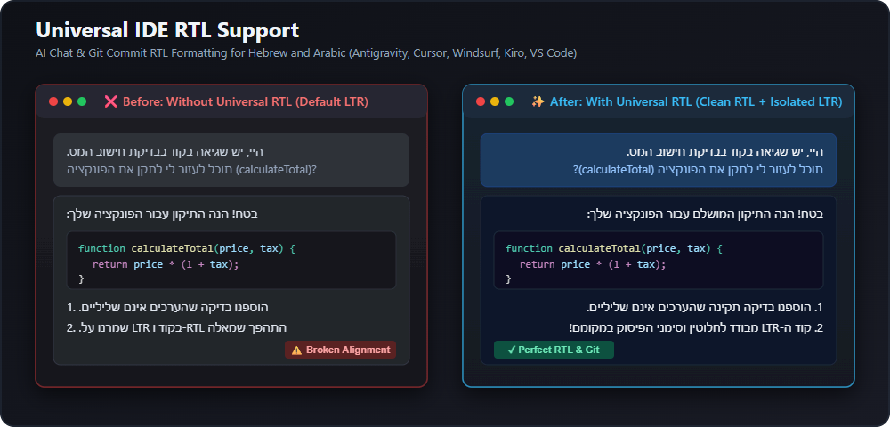

# Universal IDE RTL Support 🌐

[](https://open-vsx.org/extension/talco/universal-ide-rtl)
[](https://open-vsx.org/extension/talco/universal-ide-rtl)
[](https://open-vsx.org/extension/talco/universal-ide-rtl#review-details)
[](LICENSE)
[](https://github.com/talco318/universal-ide-rtl)

A unified extension that adds Right-to-Left (RTL) text support for **Hebrew** and **Arabic** across multiple AI-powered IDEs (Antigravity, Cursor, Windsurf, Kiro, VS Code) and Source Control Git commits.

One extension. All IDEs. Zero hassle.



> [!IMPORTANT]
> **⚡ Quick Activation / הנחיות הפעלה מהירה / تعليمات التفعيل السريع ⚡**
>
> **English:** 
> - 💡 **1-Click Welcome Prompt:** Upon installation, a notification appears offering **"Enable & Reload"** to activate RTL instantly with zero hassle!
> - **Manual Activation:** Click on **`RTL: OFF`** in the status bar (bottom-right corner) OR press **`Ctrl+Alt+R`** (Mac: `Cmd+Alt+R`) to toggle it, then click **Restart Now**.
>
> **עברית:**
> - 💡 **הפעלה מהירה בלחיצה אחת:** מיד לאחר ההתקנה תקפוץ הודעת ברוכים הבאים עם כפתור **"Enable & Reload"** להפעלה מיידית!
> - **הפעלה ידנית:** לחץ על כפתור **`RTL: OFF`** בשורת הסטטוס למטה מימין, או לחץ על קיצור המקלדת **`Ctrl+Alt+R`**, ולאחר מכן לחץ על **Restart Now**.
>
> **العربية:**
> - 💡 **تفعيل فوري بنقرة واحدة:** بمجرد تثبيت الإضافة، يظهر إشعار ترحيبي يتيح لك النقر على **"Enable & Reload"** لتفعيل محاذاة RTL مباشرة!
> - **التفعيل اليدوي:** انقر على **`RTL: OFF`** في شريط الحالة (الزاوية السفلية) أو اضغط على **`Ctrl+Alt+R`** (لنظام Mac: `Cmd+Alt+R`) للتبديل، ثم انقر على **Restart Now**.

---

## Supported IDEs & AI Assistants

| IDE / Assistant | Method | Status |
|---|---|---|
| **Antigravity** | JS Injection (workbench) | ✅ Tested (Chat & User Bubbles) |
| **Cursor** | JS Injection (workbench) | ✅ Tested (Chat & Composer) |
| **VS Code (Copilot Chat)** | JS Injection (workbench) | ✅ Tested |
| **Claude Code** (`anthropic.claude-code`) | Webview CSS & JS Injection | ✅ Tested (Chat, Plan & Header Toggle) |
| **Kiro** | CSS Patch (webview) | ✅ Tested |
| **Windsurf** | JS Injection (workbench) | 🧪 Experimental |

---

## Key Features

- 🌐 **Auto-Detection:** Automatically detects which IDE is running and applies the correct patching method.
- 🤖 **Claude Code Support:** Full Right-to-Left formatting for the official Anthropic Claude Code extension with dedicated chat toggle button.
- 🚀 **1-Click Welcome Activation:** Convenient prompt upon installation to enable and reload immediately.
- 🧠 **Smart Formatting:** RTL for Hebrew, Arabic & Persian text, LTR preserved for code blocks, inline code, diffs, buttons, and system UI.
- 🌿 **Git Commit & Source Control RTL:** Right-aligns commit messages in the Source Control panel with proper mixed English/Hebrew BiDi handling.
- 💬 **Antigravity & AI Chat Optimized:** Seamlessly formats user prompt bubbles, assistant responses, markdown tables, and blockquotes.
- ⚡ **One-Click Toggle:** Enable/disable via Status Bar or Command Palette.
- 🎹 **Keyboard Shortcut:** Toggle RTL status quickly using `Ctrl+Alt+R` (Mac: `Cmd+Alt+R`).
- 🔧 **Auto-Repair:** Automatically restores the RTL patch after IDE updates on startup.
- 🔌 **Extensible:** Add new IDEs by simply adding an entry to `ide-configs.js`.
- 💾 **Safe:** Creates backups before patching, clean removal on disable, and fixes product integrity checksums automatically.

---

## Usage

1. Install the extension in your IDE.
2. Click **Enable & Reload** on the welcome notification (or click **RTL: OFF** in the Status Bar).
3. Click **Restart Now** when prompted.

---

## Source Control & Git Commit Message Alignment 🌿

Writing commit messages in Hebrew or Arabic?
- The extension automatically detects RTL text in the **Source Control (SCM) commit box**.
- Keeps issue numbers (e.g., `#42`), tags (`feat:`, `fix:`), and English branch names correctly positioned without punctuation jumping to the wrong side.

---

## Markdown Editor & Preview Alignment 📝

The extension includes dedicated support for aligning text dynamically in the **Markdown Editor** and **Markdown Preview**:
- 🎛️ **Toolbar Button:** When editing a `.md` file or viewing a Markdown Preview, a small align-right icon appears in the editor title bar (top right).
- 🔄 **Independent Toggle:** Click the toolbar button (or press `Ctrl+Alt+R` / `Cmd+Alt+R`) to toggle RTL for that specific file. It will align Hebrew/Arabic lines in the source editor and render the markdown preview right-aligned.
- 🧹 **Reset All Files:** Run the command `RTL: Clear All RTL Editor/Preview Files` from the Command Palette to reset all stored file alignments.

## Claude Code RTL Support 🤖

The extension includes built-in support for Anthropic's **Claude Code for VS Code** (`anthropic.claude-code`) extension across VS Code, Cursor, Antigravity, and Kiro:
- ⚡ **Seamless Auto-Detection:** Automatically scans chat bubbles for Hebrew, Arabic, or Persian text and formats them in RTL with zero configuration.
- 🛡️ **Strict LTR Protection:** Code blocks, diff editors, terminal commands, tool executions, and thinking blocks are strictly protected in LTR.
- 🎛️ **Header Toggle Button:** Injects a dedicated `⇄` button directly into Claude Code's chat header for quick manual toggling.
- 📋 **Plan Preview RTL:** Supports Right-to-Left alignment inside Claude Code Plan Previews.
- ⌨️ **Commands:**
  - `RTL: Patch Claude Code Extension` (`universal-rtl.patchClaudeCode`)
  - `RTL: Unpatch Claude Code Extension` (`universal-rtl.unpatchClaudeCode`)
  - `RTL: Check Claude Code RTL Status` (`universal-rtl.checkClaudeCodeStatus`)

---

## Architecture

```
universal-rtl-extension/
├── extension.js      # Core engine - unified toggle logic
├── ide-configs.js    # IDE configuration registry (selectors, methods, paths)
├── package.json      # Extension manifest
└── README.md
```

### Adding a New IDE

Edit `ide-configs.js` and add a new entry:

```javascript
newIde: {
  name: 'New IDE',
  method: 'js-inject',  // or 'css-patch'
  detect: (appRoot) => appRoot.toLowerCase().includes('newide'),
  marker: 'START-UNIVERSAL-RTL-JS',
  script: `... your JS injection code ...`
}
```

---

## How It Works

The extension uses two patching strategies depending on the IDE architecture:

1. **CSS Patch** (Kiro): The chat runs in a separate webview with its own CSS file. The extension appends RTL rules directly to that CSS file.

2. **JS Injection** (Antigravity, Cursor, Windsurf): The chat is part of the main workbench DOM. The extension injects a MutationObserver script into `workbench.desktop.main.js` that dynamically detects RTL text and applies styles.

---

## Technical Notes

> [!WARNING]
> IDE updates may overwrite patched files. Simply run the toggle command again after an update.

- Kiro: Patches `extensions/kiro.kiro-agent/packages/continuedev/gui/dist/assets/index.css`
- Antigravity/Cursor/Windsurf: Patches `out/vs/workbench/workbench.desktop.main.js`

---

## ⭐ Support & Reviews

If Universal IDE RTL improves your daily coding workflow, please take 30 seconds to **[⭐ Leave a 5-Star Review on Open VSX](https://open-vsx.org/extension/talco/universal-ide-rtl/reviews)**! 

Your reviews help more developers in the Hebrew, Arabic, and Persian developer communities discover this extension.

---

## License

MIT License - see [LICENSE](LICENSE) for details.

Developed with ❤️ by **talco**.
